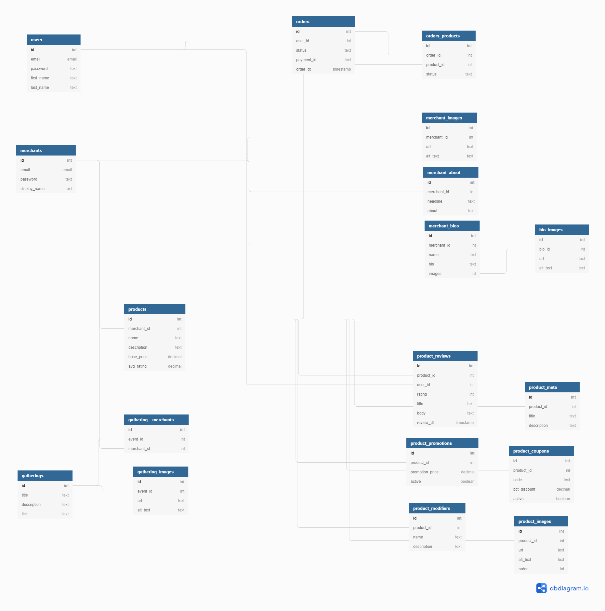

# OpusMarket - Backend

## System Requirements:
The OpusMarket Backend exposes an API which is called by its partner frontend project located at https://github.com/TrWesche/OpusMarket_FE. Any visualization of the data provided by this backend project will need to be accomplished via this partner frontend project or alternative consumer.

## Deployment Instructions:
1. The connection between the OpusMarket Backend and the Consuming Partner is secured via a Public/Private rsa key.  A key generator is included at "keygen/key-gen.js".  Running this script will create two files: "id_rsa_priv.pem" and "id_rsa_pub.pem".  The public key should be utilized by the consumer to enable the frontend to decode encrypted cookies provided by the backend.  The private key will be uitilized in the Backend's .env file.
2. OpusMarket's Data Retention is implemented utilizing a PostgreSQL database.  Prior to attempting to start the project please create a Postgres Database and populate it with the appropriate tables.  2 .sql files have been included in the git repo:
  - db_tables.sql - Database Table Definitions Only
  - db.sql - Database Table Definitions & Sample Data
3. Setup .env parameters (Reference File: .env.example)
  - DATABASE_URL - Fill this in with the location of your PostgreSQL database created in step 2.
  - PORT - Set the port where your data will be served from.  Defaults to 5000 if variable not included.
  - NODE_ENV - Set the project mode (prod or test)
  - SQUARE_APP_ID - Create a api account with Square (https://developer.squareup.com/us/en), copy in Application ID from your unique account.
  - SQUARE_TOKEN - Create a api account with Square (https://developer.squareup.com/us/en), copy in Token  from your unique account.
  - SQUARE_VERSION - This project is setup for version 2020-10-28, any updates to the version are at users own risk.
  - SQUARE_LOC_ID - Create a api account with Square (https://developer.squareup.com/us/en), copy in Location ID from your unique account.
  - SQUARE_PAYMENTS_PATH - This project is setup to interface with the Square Sandbox (https://connect.squareupsandbox.com/v2/payments).  Changing this to a newer version of the Sandbox or a non-sandbox payments path is at the users own risk.
  - ORIGIN_FRONTEND - Provide the address where your frontend server will be exposed.
  - PRIVATE_KEY - Copy the private key generated in step 1 ("id_rsa_priv.pem") to this variable.
    - Note: This environment variable is setup in the config.js file to be reformmated to operate properly.  In the string provided in "id_rsa_priv.pem" remove all return and replace them with '\n' in the string.

## Tech Stack
- Node.js
- Express.js
- Postgres.sql
- Integrations: Square API

## About:
OpusMarket provides a fully functional eCommerce website experience split between two independent projects an API Served React Front-End and Express Webserver attached to a PostgreSQL Database.

### Application Functions:
- Public Access
  - Browse/Search Products
  - View Individual Products
  - Browse/Search Merchants
  - Add/Remove Products From Cart
- Merchant Users
  - Create/Update/Delete/Login/Logout Merchant Account
  - Create/Delete Products
    - Includes: Images, Product Name, Product Description, Product Pricing, Product Promotions, Product Coupons, Featured Products, Product Tags, Product Modifiers
  - Create Personal Web Store
    - Includes: Merchant Gatherings (Events), Featured Products, About Us Section
- Purchasing Users
  - Create/Update/Delete/Login/Logout Purchasing Account
  - Purchase Products via Square
  - View Previous Orders

## Users & Merchants
- The db.sql file contains a variety of sale data to populate the backend excluding orders.
  - 6 Users Are Present - All with a password of "password"
    - cHylda@fakeprovider.com
    - bJonquil@fakeprovider.com
    - eMchumba@fakeprovider.com
    - sRasim@fakeprovider.com
    - aMarlies@fakeprovider.com
    - CAnita@fakeprovider.com
  - 20 Merchants Are Present - All with a password of "passwordpassword" (6 listed, see db.sql for full list)
    - support@graytable.com
    - support@bulbzy.com
    - support@glaazel.com
    - support@superlamp.com
    - support@techshoe.com
    - support@wearsly.com

## Database Schema

### Internal Database Functionalities:
- User Account Management
  - Users
- Merchant Account Management
  - Merchants
- Product Management
  - Products & Associated Tables
- Order Management - Transition point between Square API & Internal System
  - Orders & Orders_Products
- Event Management - Transition point between Discord API & Internal System
  - Events

### Additional Git Files
- This git repository also includes a Postman collection for testing the API directly under the name "OpusMarket Routes.postman_collection.json"